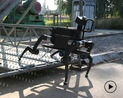

# robotics-hw0

## Sensing
The robot most likely uses GPS coordinates to determine its current location.

## Planning
The robot probably utilizes computer vision to determine areas that have relatively few obstacles in its
line of sight. It then determines what direction to steer.

## Acting
The robot most likely computes a set of waypoints (2D coordinates) for a desired location, and utilizes
inverse kinematics to figure out the desired angle configurations of the joints to move to the location.

<a href="https://www.youtube.com/watch?v=M8YjvHYbZ9w">Link to robot video</a>
