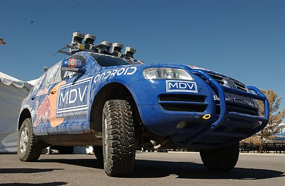

# robotics-hw0

## Sensing
The robot uses a laser mapper to detect obstacles on its path. It also uses probablistic Kalman filters to determine where the center of the road is.

## Planning
The robot's path planner varies its lateral offset to change the direction it moves on the road.

## Acting
The robot utilizes a velocity controller and a steering controller to move. The velocity controller takes the minimum of three speeds computed by software modules. (For more information on the robot in the picture above: http://onlinelibrary.wiley.com/doi/10.1002/rob.20147/epdf)

<a href="https://www.youtube.com/watch?v=M8YjvHYbZ9w">Link to robot video</a>
